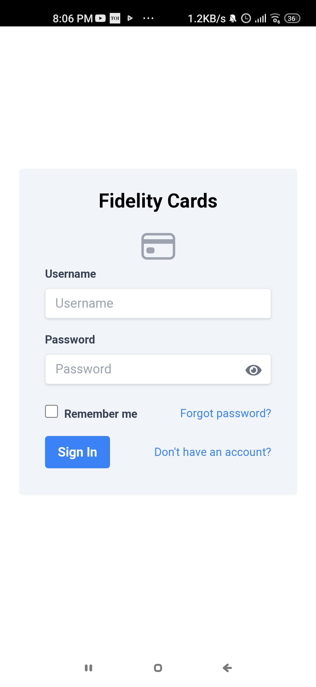
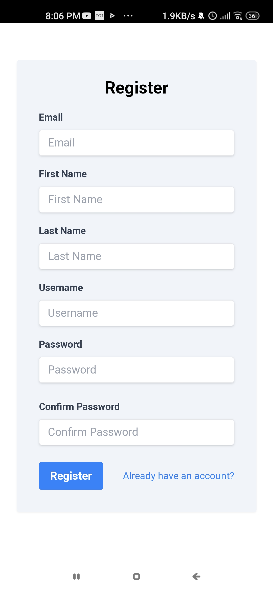
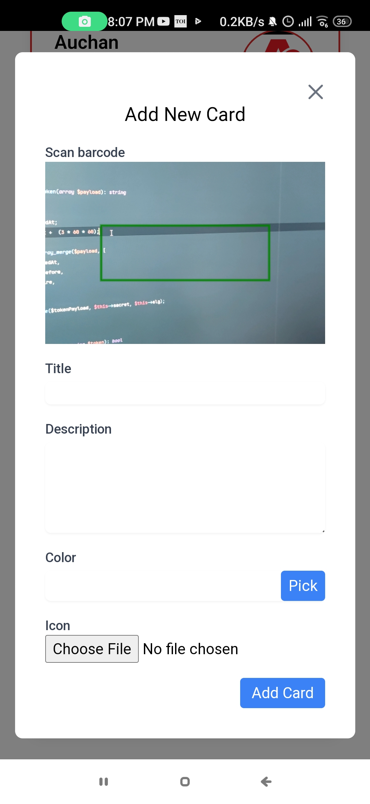
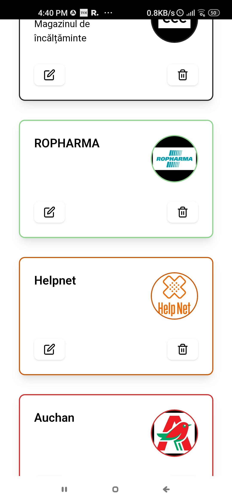
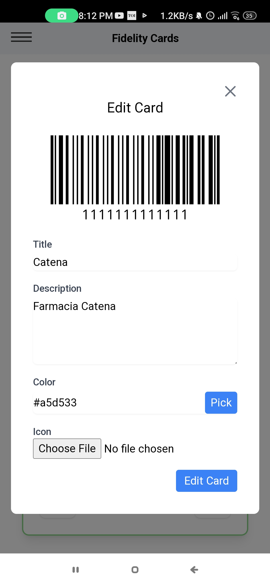

## Overview
The Fidelity Card Manager App is a web application developed using React for the frontend and PHP with the Slim framework for the backend. It is designed to help individuals efficiently manage their fidelity cards by providing features such as scanning cards, storing card details, and tracking rewards. The application follows the Domain-Driven Design (DDD) approach to ensure a clean and modular architecture.

### Technologies Used
#### Frontend
React: A popular JavaScript library for building user interfaces.
HTML5/CSS3: Markup and styling languages for structuring and presenting web content.
JavaScript: Programming language used for frontend interactivity and logic.
Redux: A predictable state container for managing application state.
#### Backend
PHP: Server-side scripting language used for backend development.
Slim Framework: A lightweight PHP framework for building APIs and web applications.
MySQL: Relational database management system for storing fidelity card data.
Composer: Dependency management tool for PHP.

## Screenshots

Here are some screenshots of the Fidelity Card Manager App:

1. **Login Page:**

   

2. **Register Page:**

   

3. **Card Scanning:**

   

4. **Cards Listing Page:**

   
   
4. **Cards Edit Page:**

   

## Environment Configuration

To run the Fidelity Card Manager App, you'll need to set up your environment variables by creating a `.env` file in the root directory of the backend project. Below is an example of the `.env` file contents:

````DB_HOST=localhost
DB_DATABASE=db
DB_USERNAME=user
DB_PASSWORD=pass
JWT_SECRET=XXXXXXXXXXXX
API_URL=https://example.com/api
APP_URL=https://example.com
MAIL_HOST=
MAIL_PORT=
MAIL_SMTP_SECURE=ssl
MAIL_FROM_ADDRESS=email@example.com
MAIL_FROM_NAME="Radu Ungurean"
MAILGUN_DOMAIN=
MAILGUN_SECRET=XXXXXXXXXXXX
ICONS_PATH=/home/api-cards/public_html/icons
